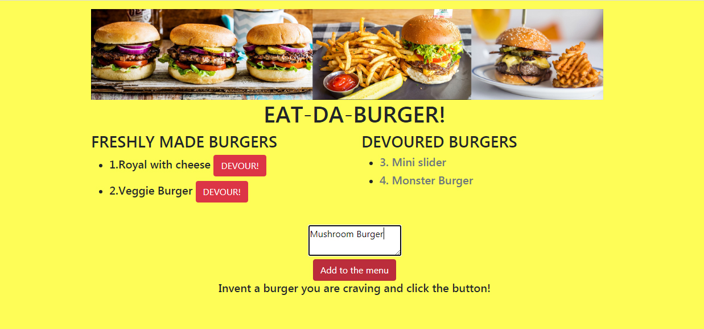
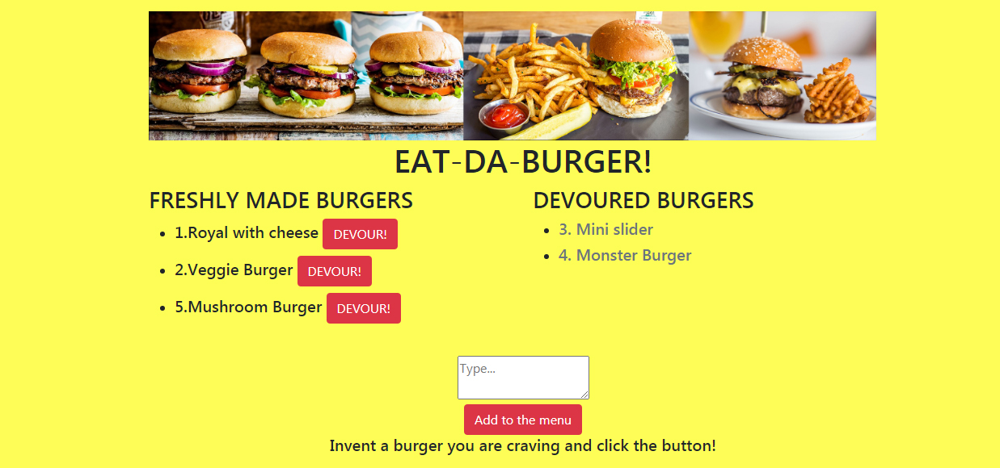
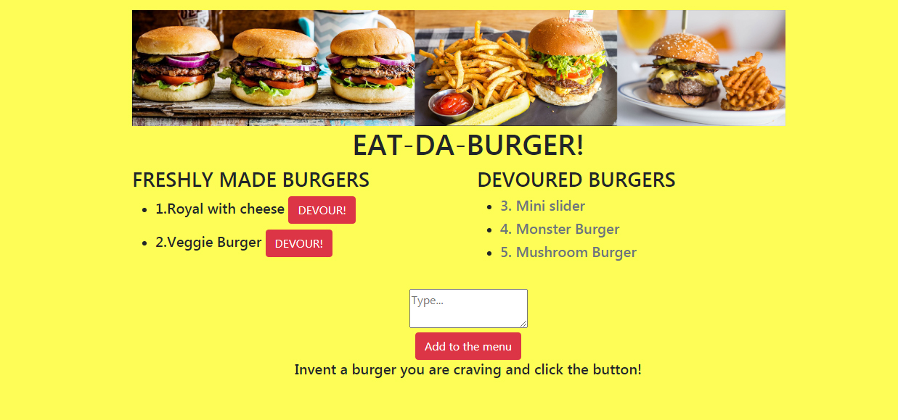

 [Link to my Portfolio, featuring my lastest apps](https://anaiva27.github.io/My-portfolio/portfolio.html) <br>
 [Link to the deployed app](https://eat-the-burger-yum.herokuapp.com/)

# Burger-Logger
 

## Table of Contents
  * [Description](#Description)
  * [Installation](#Installation)
  * [Usage](#Usage)
  * [License](#License)

## Description
This application allows users to manipulate items (burgers) using a variety of technologies and programming languages such as JavaScript, SQL, jQuery, HTML, CSS, API requests, ORM, Ajax calls, Handlebars, Express.js and Node.js. The repository is organized according to MVC framework standarts. This full-stack app also introduces fun and intuitive interface.
<br>

## Installation
Eat-Da-Burger application is deployed on Heroku platform, utilizing JawsDB add-on. The webpage can be accessed by following the link at the top og the page.
To run this application on a local machine, the user will need to install Node.js and MySQL Workbench, then initialize the folder containing the application by typing `npm init -y` and `npm i` in the command line to install required dependencies such as `mysql, express, bodyParser`. The `package.json` will hold various metadata that's relevant to the project. Also the user has to run the SQL script `schema.sql`  and `seeds.sql` located in the `db` folder in the root directory.

```
npm init -y 
npm i
``` 
<br>

## Usage 

After user clicks the link, he will be directed to the index page with 2 tables containing names of the burgers. Underneath there's an emplty text field, where user can input the name of the burger and after clicking the submit button, the name of the burger will appear on the left side of the screen, in the first table. Right next topthe burger the will be a red button `Devour`. When the user will click that button, the burger will move to the table on the right, as it changes the devoured status from `false` to `true` in the database called `burgers_db`.<br>

<br>
Screenshots:<br>
User inputs a burger: <br> 

 <br>
<br>
The item moved to the first table: <br>

 <br>

Then moved to the "devoured": <br>
 <br>
<br>

## License
Copyright © 2020 Anastasia Ivashchenko

    Permission is hereby granted, free of charge, to any person obtaining a copy of this software and associated documentation files (the "Software"), to deal in the Software without restriction, including without limitation the rights to use, copy, modify, merge, publish, distribute, sublicense, and/or sell copies of the Software, and to permit persons to whom the Software is furnished to do so, subject to the following conditions:
    
    The above copyright notice and this permission notice shall be included in all copies or substantial portions of the Software.
    
    THE SOFTWARE IS PROVIDED "AS IS", WITHOUT WARRANTY OF ANY KIND, EXPRESS OR IMPLIED, INCLUDING BUT NOT LIMITED TO THE WARRANTIES OF MERCHANTABILITY, FITNESS FOR A PARTICULAR PURPOSE AND NONINFRINGEMENT. IN NO EVENT SHALL THE AUTHORS OR COPYRIGHT HOLDERS BE LIABLE FOR ANY CLAIM, DAMAGES OR OTHER LIABILITY, WHETHER IN AN ACTION OF CONTRACT, TORT OR OTHERWISE, ARISING FROM, OUT OF OR IN CONNECTION WITH THE SOFTWARE OR THE USE OR OTHER DEALINGS IN THE SOFTWARE.
    